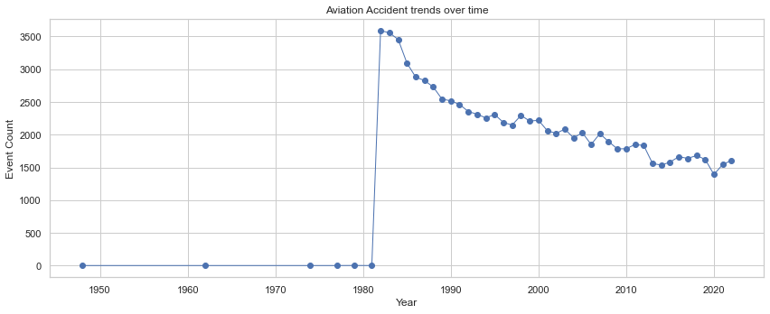

#  **Aviation Accident Analysis — Phase 1 Project**
> *A Data-Driven Approach to Evaluating Aircraft Safety using the CRISP-DM Framework*

##  Business Understanding

The company plans to expand into the **aviation industry** by purchasing and operating airplanes for commercial and private services. However, there is limited understanding of **aircraft safety risks**, which could lead to poor investment choices and operational losses.

### Objective
Use historical **aviation accident data (1962–2023)** to identify the **safest aircraft types and manufacturers** and provide actionable, data-driven recommendations.

### Key Questions
- Which aircraft types have the most and fewest accidents?  
- How have accident trends changed over time?  
- Which manufacturers have the lowest fatality rates?  
- Which flight phases are most prone to incidents?

### Stakeholders
- **Head of Aviation Division** – makes purchase decisions.  
- **Executives** – focus on minimizing financial and operational risk.  
- **Operations Team** – responsible for aircraft safety and maintenance.

### Business Value
The analysis supports **data-driven decisions**, reduces **risk exposure**, and helps the company **invest in safer, more reliable aircraft**.
##  Data Understanding

The dataset from the **Aviation_Data.csv** covers aviation accidents from **1962–2023**, including details like aircraft make, model, weather, and flight phase.

**Overview**
- Thousands of records across 60+ years.   
- Useful columns for safety and risk analysis.  

## Exploratory Data Analysis (EDA)

Exploratory analysis was conducted to identify key patterns and trends in aviation accidents.

**Key Insights**
- Most accidents occurred under **clear weather (VMC)**, suggesting human or mechanical causes.  
- **Takeoff and landing** were the riskiest flight phases.  
- Accident rates have **declined over time**, reflecting safety improvements.  
- Some **manufacturers** showed consistently lower fatality rates.

**Visualization 1**

## Interpretation: Top 12 Aircraft Makes by Event Count

- **Cessna** has the highest number of recorded events. This is likely because it is one of the most common aircraft types used for training and private flights.  
- **Piper** and **Beech** also have a large number of events, showing they are common in general aviation.  
- The chart shows some names repeated in different cases (like *Cessna* and *CESSNA*). This suggests the data needs cleaning to make all names consistent.  
- **Boeing** and **Bell** appear lower in the chart since they represent larger or commercial aircraft, which have fewer events compared to smaller planes.  
- Overall, most events involve **small, general aviation aircraft** rather than large commercial ones.  

**Visualization 2**

### Accidents by Phase of Flight

The chart above shows the distribution of aviation accidents across different flight phases.  

**Key insights:**
- **Landing** and **Takeoff** phases account for the majority of accidents — together making up over half of all recorded incidents.
- **Cruise** and **Maneuvering** phases also show significant numbers, but fewer compared to landing and takeoff.
- Phases like **Descent**, **Taxi**, and **Standing** record comparatively fewer accidents.
- The **Unknown** and **Other** categories likely represent incomplete or unclassified data entries.

**Interpretation:**
These results align with aviation safety research, which shows that most accidents occur during **critical flight phases** — specifically takeoff and landing — where pilot workload and risk are highest. This suggests that **safety training, equipment maintenance, and automation improvements** during these phases could significantly reduce accident rates.

**Visualization 3**

# Interpretation**
 The trend shows how accident reporting or actual accident frequency has changed over time. "
      "Recent decreasing trends may reflect improved safety or changes in reporting; any spike years should be investigated."

**Visualization 4**

 ###  Interpretation: Accidents by Aircraft Category

The chart illustrates that **airplanes** account for an overwhelming majority of recorded aviation accidents—**far exceeding all other aircraft categories combined**. This dominance suggests that airplanes are either more frequently operated or more extensively reported in accident databases compared to other aircraft types.

**Helicopters** appear as the second most affected category, though their accident count is significantly lower. Other categories such as **gliders**, **balloons**, and **ultralight aircraft** contribute only marginally to the overall accident numbers.

Overall, this distribution likely reflects **operational exposure rather than inherent safety risk**, as airplanes constitute the largest share of both commercial and general aviation activities.